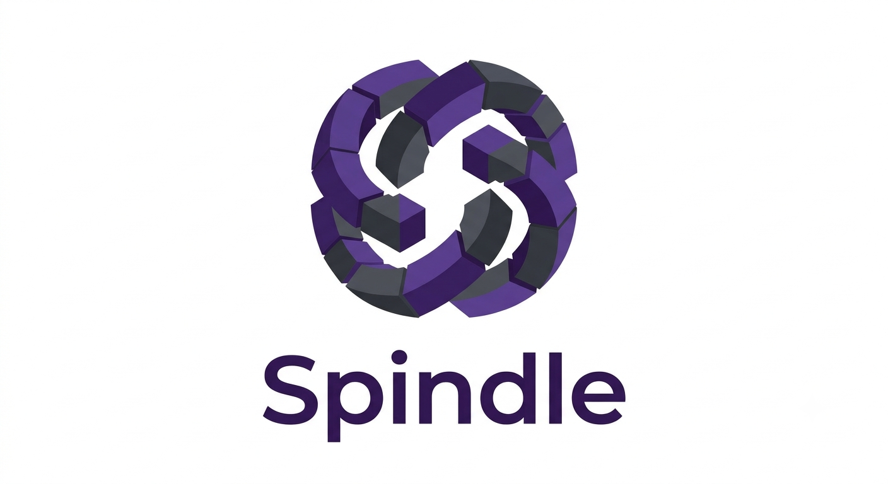

# Spindle

<div align="center">
  <br>

  [](https://opensource.org/licenses/MIT)
  []()
  []()
  []()
  
</div>

A high-performance, multithreaded Key-Value engine written in Modern C++ (C++20).

## Download & Installation

### Option 1: Building from Source (Recommended)
You can clone the repository and build it locally:
```bash
# 1. Clone the repository
git clone https://github.com/DoanTrungHuy/Spindle.git
cd Spindle

# 2. Build the project
mkdir build && cd build
cmake ..
make -j$(nproc)
```

### Option 2: Using FetchContent in your CMake project
Add the following to your `CMakeLists.txt`:
```cmake
include(FetchContent)
FetchContent_Declare(
  Spindle
  GIT_REPOSITORY https://github.com/DoanTrungHuy/Spindle.git
  GIT_TAG        master
)
FetchContent_MakeAvailable(Spindle)

# Link it to your executable
add_executable(my_app main.cpp)
target_link_libraries(my_app PRIVATE spindle)
```

## Running the Server

Start the Spindle server from the build directory.

```bash
# Start with default settings (Host: 0.0.0.0, Port: 8888, Threads: 4)
./spindle_app

# Start with custom host, port, and number of threads
./spindle_app --host 127.0.0.1 --port 6379 --threads 8
```

## Usage Guides

Spindle uses a simple text-based TCP protocol. You can connect to it using any language that supports TCP sockets. The default server socket is `0.0.0.0:8888` (reachable via `127.0.0.1` locally). Commands are sent with a newline character (`\n`) at the end.

### Java (using the provided SDK)
A Java client is provided in the `clients/java/` directory.

```java
import clients.java.SpindleClient;

public class Main {
    public static void main(String[] args) {
        SpindleClient client = new SpindleClient("127.0.0.1", 8888);
        try {
            client.connect();
            
            // Set key with expiration
            client.setEx("session:1", "active", 3600);
            System.out.println(client.get("session:1"));
            
            client.delete("session:1");
        } catch (Exception e) {
            e.printStackTrace();
        } finally {
            client.close();
        }
    }
}
```

### Python (using the provided SDK)
A Python client is provided in the `clients/python/` directory.

```python
import sys
# Assuming you are in the project root
sys.path.append('clients/python')

from spindle import SpindleClient

# Connect to the server (default is 127.0.0.1:8888)
client = SpindleClient(host='127.0.0.1', port=8888)
client.connect()

client.set("session:1", "active", ex=3600) # Set key with expiration
print(client.get("session:1"))

client.delete("session:1")
client.close()
```

### Node.js / JavaScript
A JavaScript client (using Promises) is provided in the `clients/javascript/` directory.

```javascript
const SpindleClient = require('./clients/javascript/spindle');

async function main() {
    const client = new SpindleClient('127.0.0.1', 8888);
    
    try {
        await client.connect();
        
        // Set key with expiration
        await client.set("session:1", "active", { ex: 3600 });
        console.log(await client.get("session:1"));
        
        await client.delete("session:1");
    } catch (err) {
        console.error(err);
    } finally {
        client.close();
    }
}

main();
```

### cURL / Netcat (Command Line)
You can test the server directly from your terminal using `nc` (netcat):

```bash
# Connect to Spindle
nc 127.0.0.1 8888
# Then type commands:
SET mykey hello
GET mykey
DEL mykey
```

### Other Languages (C#, PHP, Rust, C++, etc.)
Since Spindle is built on a simple raw text-based TCP protocol, **you do not need any special database drivers**. You can build your own client in absolutely any programming language using its standard built-in TCP Socket library (e.g., `TcpClient` in C#, `fsockopen` in PHP, `std::net::TcpStream` in Rust). 

To interact with Spindle:
1. Open a TCP connection to the server IP and port.
2. Send your command as a string, terminated by a newline character `\n`.
3. Read the response string (also terminated by `\n`).

## Features
- **High Performance**: Optimized with low-level techniques (Slab Allocation, Spinlocks, Reactor pattern).
- **Multithreaded**: Built to handle concurrent workloads efficiently.
- **Persistent**: Includes a Write-Ahead Log (WAL) flusher for data safety.
- **Easy to integrate**: CMake-friendly and exportable as a static/shared library.

## License

This project is licensed under the MIT License - see the [LICENSE](LICENSE) file for details.
